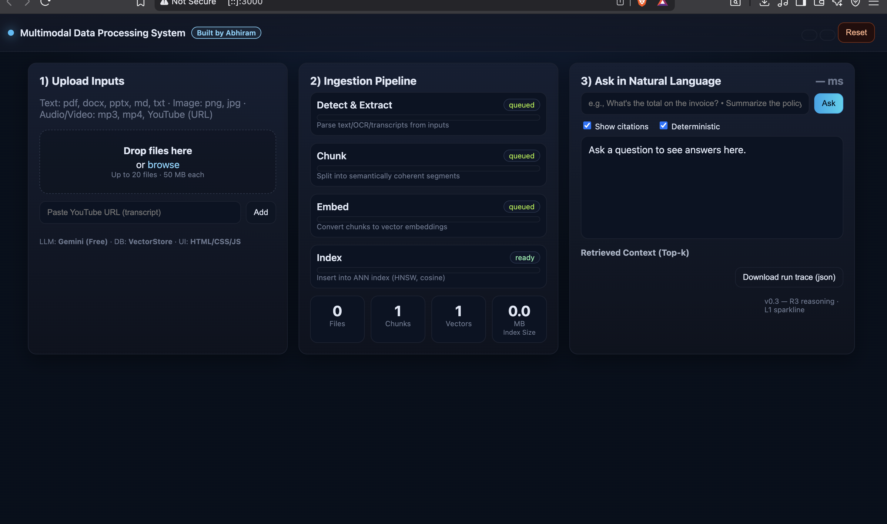

# 🧠 Multimodal RAG (Gemini + FAISS)

A **real working multimodal Retrieval-Augmented Generation (RAG)** system that ingests PDFs, DOCX files, text/markdown, **images (OCR)**, and **YouTube transcripts**, converts them into semantic embeddings using **Sentence Transformers**, indexes them into **FAISS**, and performs **LLM-grounded answering** using **Google Gemini (Free API)**.

This project is built to demonstrate a **production-style pipeline** while remaining **lightweight and fully local** for indexing & retrieval. Gemini is used only for the final reasoning/answering step.

---

## ✅ Key Features

| Capability | Status |
|-----------|--------|
| PDF ingestion (real) | ✅ |
| Image OCR (pytesseract) | ✅ |
| DOCX, MD, TXT support | ✅ |
| YouTube transcript fetch | ✅ |
| Semantic chunking | ✅ |
| Embeddings via SBERT | ✅ |
| FAISS vector index | ✅ |
| Gemini 1.5 Flash for final answer | ✅ |
| Mac (Apple Silicon) setup tested | ✅ |

---

---

## 🛠 Tech Stack

| Layer                | Tech                                     |
| -------------------- | ---------------------------------------- |
| LLM                  | Gemini 1.5 Flash (Free Tier)             |
| Vector DB            | FAISS (CPU)                              |
| Embeddings           | `sentence-transformers/all-MiniLM-L6-v2` |
| OCR                  | Tesseract (Apple Silicon)                |
| PDF parsing          | pdfminer.six                             |
| Transcript ingestion | youtube-transcript-api                   |
| API backend          | FastAPI                                  |
| UI                   | Auto-served HTML (no Streamlit)          |

---

## ✅ Mac (Apple Silicon / M1/M2/M3/M4) Setup

### 1️⃣ Install Tesseract (for OCR)

```bash
brew install tesseract
```

### 2️⃣ Create a venv (recommended)

```bash
python3 -m venv venv
source venv/bin/activate
```

### 3️⃣ Install Python deps

```bash
pip install fastapi uvicorn[standard] google-generativeai \
    sentence-transformers faiss-cpu pdfminer.six pytesseract \
    python-docx youtube-transcript-api pillow
```

### 4️⃣ Export Gemini API key

```bash
export GEMINI_API_KEY="YOUR_KEY_HERE"
```

### 5️⃣ Run the server

```bash
uvicorn app:app --reload
```

Then visit:

```
http://localhost:8000/
```

---

## 📸 Screenshots

### 1) Upload & Ingest  


### 2) Ingestion Pipeline  


### 3) Top-k Retrieval  


### 4) Grounded Gemini Answer  


---

## 🔬 Why RAG instead of vanilla LLM?

| Problem        | Pure LLM            | With RAG                    |
| -------------- | ------------------- | --------------------------- |
| Data freshness | ❌ hallucinations    | ✅ grounded in uploaded docs |
| Citations      | ❌ no traceability   | ✅ chunk-level evidence      |
| Domain files   | ❌ forgotten context | ✅ FAISS vector search       |
| Multimedia     | ❌ text-only         | ✅ OCR + transcripts         |

---

## 📌 Future Work (Upgrade Path)

| Next Step        | Upgrade                             |
| ---------------- | ----------------------------------- |
| Audio/Video      | Add Whisper / Gemini audio pipeline |
| Vision reasoning | Gemini Vision → chunk alignment     |
| Cloud            | GCS storage + remote vector DB      |
| Auth             | JWT + role-based retrieval access   |

---

## 📄 License

MIT License — You are free to extend and publish this system.

---

